# Integración con Blockchain (Chainlink CRE)

Esta documentación describe cómo funciona la integración entre el smart contract de Chainlink CRE y el frontend del juego de Catán.

## 📋 Resumen

Cuando un juego es activado en el smart contract de Chainlink CRE, el workflow envía un payload JSON al endpoint `/api/game/start` con toda la configuración del juego:

- **4 jugadores AI** con sus modelos específicos
- **19 hexágonos** con recursos específicos
- **Metadatos del blockchain** (apostador, depósito, timestamps, etc.)

## 🔗 Endpoint

```
POST /api/game/start
Content-Type: application/json
```

### Payload

Ver detalles completos en [`cre-catan/start-game/API_PAYLOAD.md`](./cre-catan/start-game/API_PAYLOAD.md)

Ejemplo mínimo:

```json
{
  "gameId": "2",
  "bettor": "0x5ee75a1B1648C023e885E58bD3735Ae273f2cc52",
  "deposit": "100000000000000",
  "status": 1,
  "bettorChoice": 0,
  "requestId": "123456789",
  "startTime": "1700000000",
  "aiPlayers": [
    {
      "index": 0,
      "company": 0,
      "modelIndex": 1,
      "modelName": "anthropic/claude-sonnet-4.5",
      "playOrder": 3
    },
    // ... 3 jugadores más
  ],
  "board": [
    {
      "index": 0,
      "resource": 3
    },
    // ... 18 hexágonos más
  ]
}
```

### Respuesta Exitosa

```json
{
  "success": true,
  "gameId": "blockchain_2",
  "blockchainGameId": "2",
  "message": "Game created from blockchain successfully",
  "players": [
    {
      "id": "player_1",
      "name": "Google Gemini Flash",
      "color": "red"
    }
    // ... más jugadores
  ],
  "metadata": {
    "bettor": "0x5ee75a1B1648C023e885E58bD3735Ae273f2cc52",
    "deposit": "100000000000000",
    "bettorChoice": 0
  }
}
```

## 🎮 Flujo de Integración

```mermaid
graph LR
    A[Smart Contract] -->|Chainlink CRE| B[POST /api/game/start]
    B --> C[createGameFromBlockchain]
    C --> D[Genera tablero con recursos específicos]
    C --> E[Crea 4 jugadores AI ordenados]
    C --> F[Guarda metadatos blockchain]
    D --> G[GameState completo]
    E --> G
    F --> G
    G --> H[createBlockchainGameSession]
    H --> I[Game ID: blockchain_X]
    I --> J[Juego disponible en /game/blockchain_X]
```



## 📂 Archivos Modificados

### Nuevos Archivos

1. **`app/api/game/start/route.ts`** - Endpoint para recibir payload del blockchain
2. **`components/blockchain-info.tsx`** - Componente para mostrar metadatos del blockchain
3. **`scripts/test-blockchain-game.ts`** - Script de prueba

### Archivos Actualizados

1. **`lib/types.ts`** - Añadido `BlockchainMetadata`, campos opcionales en `Player` y `HexTile`
2. **`lib/game-engine.ts`** - Nueva función `createGameFromBlockchain()`
3. **`lib/board-generator.ts`** - Soporte para `BlockchainBoardConfig`
4. **`lib/game-store.ts`** - Nueva función `createBlockchainGameSession()`
5. **`app/game/[gameId]/page.tsx`** - Muestra información del blockchain si existe

## 🧪 Pruebas

### Opción 1: Script de Prueba

```bash
# Asegúrate de que el servidor esté corriendo
npm run dev

# En otra terminal, ejecuta el script de prueba
npx tsx scripts/test-blockchain-game.ts
```

### Opción 2: cURL

```bash
curl -X POST http://localhost:3000/api/game/start \
  -H "Content-Type: application/json" \
  -d @cre-catan/start-game/example-payload.json
```

### Opción 3: Payload Directo

```bash
curl -X POST http://localhost:3000/api/game/start \
  -H "Content-Type: application/json" \
  -d '{
  "gameId": "123",
  "bettor": "0x742d35Cc6634C0532925a3b844Bc454e4438f44e",
  "deposit": "50000000000000000",
  "status": 1,
  "randomReady": true,
  "bettorChoice": 2,
  "requestId": "test-123",
  "startTime": "1732377600",
  "endTime": "0",
  "winner": 0,
  "aiPlayers": [
    {
      "index": 0,
      "company": 0,
      "companyName": "ANTHROPIC",
      "modelIndex": 1,
      "modelName": "anthropic/claude-sonnet-4.5",
      "playOrder": 1
    },
    {
      "index": 1,
      "company": 1,
      "companyName": "GOOGLE",
      "modelIndex": 3,
      "modelName": "google/gemini-2.5-flash",
      "playOrder": 2
    },
    {
      "index": 2,
      "company": 2,
      "companyName": "OPENAI",
      "modelIndex": 4,
      "modelName": "openai/gpt-5",
      "playOrder": 3
    },
    {
      "index": 3,
      "company": 3,
      "companyName": "XAI",
      "modelIndex": 7,
      "modelName": "xai/grok-4-fast-reasoning",
      "playOrder": 4
    }
  ],
  "board": [
    {"index": 0, "resource": 3},
    {"index": 1, "resource": 0},
    {"index": 2, "resource": 0},
    {"index": 3, "resource": 4},
    {"index": 4, "resource": 3},
    {"index": 5, "resource": 2},
    {"index": 6, "resource": 0},
    {"index": 7, "resource": 0},
    {"index": 8, "resource": 3},
    {"index": 9, "resource": 1},
    {"index": 10, "resource": 2},
    {"index": 11, "resource": 5},
    {"index": 12, "resource": 2},
    {"index": 13, "resource": 1},
    {"index": 14, "resource": 2},
    {"index": 15, "resource": 4},
    {"index": 16, "resource": 1},
    {"index": 17, "resource": 1},
    {"index": 18, "resource": 4}
  ]
}'
```

## 🎯 Características

### ✅ Implementado

- [x] Endpoint `/api/game/start` para recibir payload del blockchain
- [x] Creación de juegos con configuración específica del smart contract
- [x] Mapeo de recursos del blockchain a terrenos del juego
- [x] Mapeo de modelos AI del smart contract a jugadores
- [x] Ordenamiento de jugadores según `playOrder`
- [x] Almacenamiento de metadatos del blockchain
- [x] Identificadores únicos para juegos blockchain (`blockchain_X`)
- [x] Componente UI para mostrar información del blockchain
- [x] Script de prueba integrado

### 🔮 Próximas Mejoras

- [ ] Webhook para actualizar estado del juego en el smart contract
- [ ] Reportar ganador al smart contract al finalizar
- [ ] Integración con Chainlink Explorer (links directos)
- [ ] Configuración de números de dados del blockchain
- [ ] Verificación de firma del payload (seguridad)

## 📊 Mapeo de Datos

### Recursos (Blockchain → Juego)

| Blockchain | Nombre     | Terreno en Juego |
|------------|------------|------------------|
| 0          | WOOD       | `wood`           |
| 1          | SHEEP      | `sheep`          |
| 2          | WHEAT      | `wheat`          |
| 3          | BRICK      | `brick`          |
| 4          | ORE        | `ore`            |
| 5          | DESERT     | `desert`         |

### Modelos AI

| Index | Modelo                               | Nombre Display           |
|-------|--------------------------------------|--------------------------|
| 0     | anthropic/claude-haiku-4.5           | Claude Haiku 4.5         |
| 1     | anthropic/claude-sonnet-4.5          | Claude Sonnet 4.5        |
| 2     | google/gemini-2.5-flash-lite         | Gemini Flash Lite        |
| 3     | google/gemini-2.5-flash              | Gemini Flash             |
| 4     | openai/gpt-5                         | GPT-5                    |
| 5     | openai/gpt-5-codex                   | GPT-5 Codex              |
| 6     | xai/grok-4                           | Grok 4                   |
| 7     | xai/grok-4-fast-reasoning            | Grok 4 Fast              |
| 8     | deepseek/deepseek-v3.2-exp-thinking  | DeepSeek Thinking        |
| 9     | deepseek/deepseek-v3.2-exp           | DeepSeek V3.2            |

### Estados del Juego

| Status | Nombre                | Descripción                        |
|--------|----------------------|-------------------------------------|
| 0      | PENDING_RANDOMNESS   | Esperando aleatoriedad VRF          |
| 1      | ACTIVE               | Juego en progreso                   |
| 2      | FINISHED             | Juego completado                    |
| 3      | CANCELLED            | Juego cancelado                     |

## 🔐 Seguridad

### Validaciones Implementadas

- ✅ Validación de estructura del payload
- ✅ Validación de 4 jugadores exactos
- ✅ Validación de 19 hexágonos exactos
- ✅ Validación de recursos válidos (0-5)
- ✅ Logging detallado de operaciones

### Recomendaciones Futuras

- [ ] Autenticación del origen del request (Chainlink CRE)
- [ ] Validación de firma criptográfica
- [ ] Rate limiting del endpoint
- [ ] Whitelist de direcciones de bettor válidas

## 📝 Notas

1. **Game IDs**: Los juegos del blockchain usan el formato `blockchain_X` donde X es el gameId del smart contract
2. **Play Order**: Los jugadores se ordenan según el campo `playOrder` (1-4) del smart contract
3. **Recursos**: Los recursos se mapean exactamente según el layout del blockchain
4. **Números de Dados**: Actualmente se usan los números del layout clásico (futuro: del blockchain)
5. **Colores**: Los colores se asignan en orden: rojo, azul, blanco, naranja

## 🤝 Contacto

Para preguntas o problemas con la integración, contacta al equipo de desarrollo.

